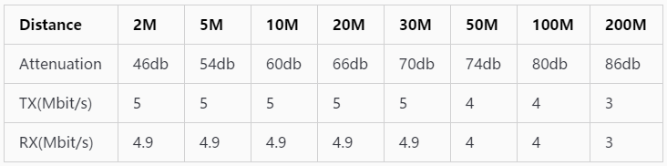
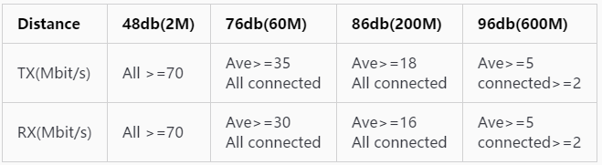
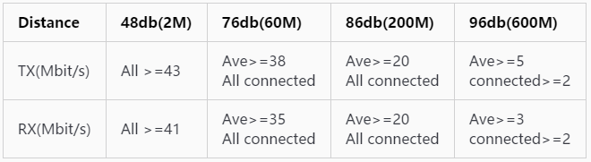
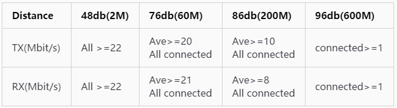
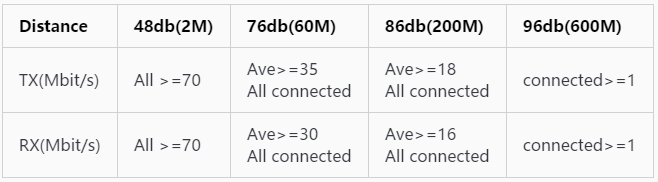
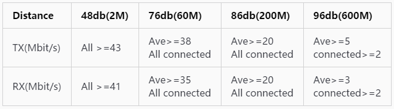
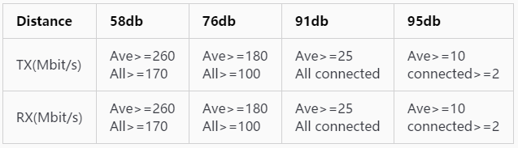
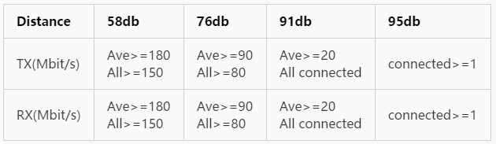

# 测试WIFI Throughput及Debug
###### *测试方法*
>1. 测试工具  
工具分为 IxChariot 和 Iperf ，均需要PC配合  
IxChariot：WIFI联盟及正式认证测试机构实验室较为常用，
正式软件为收费软件，可得到破解授权版本进行使用，测试时使用配置脚本进行测试 TX 和 RX，
自带有多种脚本(默认、High-Performance、Low-Performance、Ultra-High-Performance)，
根据测试验证，测试Android系统需要使用至少 **6.7** 版本  
(昆山Sporton实验室使用5.4版本无法和样机进行通信以进行测试，上海Tejet实验室使用6.7)  
Iperf：开发及debug常用，可看到重传的次数(在吞吐量测试中
重传过多必然导致吞吐量数据偏低，重传的原因有很多，需要抓取 air log/sniffer log)  
另外，还有PC端 Jperf 工具，此工具为iperf的PC端桌面可视化工具
>2. IxChariot测试  
设备端：安装 **Endpoint App** ，设备连接WIFI热点后，运行Endpoint，若Endpoint显示
设备的IP地址，则运行正常  
PC端：通过网线连接至路由器，依据客户联想对实验室的要求，TX及RX均需要建立 **四个** pair，
同行进行四个pair测试，每一个pair需要输入设备和PC的IP地址，Network Protocol选择TCP，
Select Script选择相应的Throughput脚本(联想要求：所有设备均选择默认的Throughput.scr)，
设定完成后，Run->Set Run Options 选择单次运行时间，Ctrl+R 即可开始测试，测试结果如下图
(可选择查看每一个pair或group的结果显示)  
  
上图中 489.415 即为测得的结果  
>3. Iperf测试  
当前可使用 **iperf2** 和 **iperf3** 进行测试，Vega PDK版本中已集成了 iperf3(依据Android
趋势，后续Android系统中均会内置iperf3)，同iperf2相比，iperf3重新构建了代码框架，优化了
使用，将一些需要加入参数方可生效的功能设为默认，另外，iperf3还更好支持更大的网络带宽  
PC端：不需要安装，仅需要在iperf3的目录下用cmd窗口运行命令即可  
设备端：iperf2版本，网上可容易下载到apk，即若使用iperf2版本进行测试，有两种方法，一是
安装app，如使用普通app一样打开，或者通过adb工具进入命令行操作，但后续执行的指令是
一样的，可根据情况选择；iperf3版本，当前未获取到相应的apk，只通过adb进行  
iperf2 指令  
Server：`iperf -s –i 1`  
Client：`iperf -c Server_IP –w1m –i1 –t30 –P4 `  
iperf3 指令  
Server：`iperf3 -s`  
Client：`iperf3 -c Server_IP -i 1 -t 30 -w 2M -P4`  
---
###### *客户联想标准 v2.0*
>1. **IxChariot 标准**  
802.11ac带宽为80MHz外，a/n为40MHz, b/g为20MHz  
802.11b  
  
802.11g  
  
802.11n  2X2 2.4GHz 需要测试4个角度，均分360  
  
802.11n  1X1 2.4GHz 需要测试4个角度，均分360  
  
802.11a 5GHz 需要测试4个角度，均分360  
  
802.11n 2X2 5GHz 需要测试4个角度，均分360  
  
802.11n 1X1 5GHz 需要测试4个角度，均分360  
  
802.11ac 2X2 5GHz 需要测试4个角度，均分360  
  
802.11ac 1X1 5GHz 需要测试4个角度，均分360  
  
>2. **Iperf标准 (测试路由器：R6300V2, 2X2)**  
  
  
---
###### *问题及Debug*  
>1. 问题描述  
上海Tejet实验室基本承包了联想的手机、平板测试，昆山Sporton实验室承包了笔记本的测试  
相同点：均熟悉样机测试流程，能够熟练进行测试及记录数据，均有足够的测试经验；路由器的性能及环境均有各自问题，
对IxChariot的使用及测试标准的疑问均缺少深度掌握，由于联想是大客户，一切事宜必须获取联想的许可。  
不同点之Tejet：对环境的把握更差一些，距离高通近，方便调试，测试路由器可以涵盖所有测试项  
不同点之Sporton：知晓先确定环境无误才能进行正式测试，即测试前会用已PASS的设备进行预测试，保证测试环境无问题，
但路由器单一，但5G 11n/11ac不能区分  
**此项测试以Tejet测试结果为准**  
Tejet出现的问题 ：测试802.11ac/802.11n(2.4GHz)/802.11g Fail，且出现前后测试结果不一的现象  
Sporton出现的问题：测试802.11n(2.4GHz)/802.11g Fail  
Debug过程中在上海高通出现的问题：测试802.11n(2.4GHz)数据波动  
>2. Debug  
存在的难点：依据高通的解释，测试性能相关，必须以Performance版本测试，实际performance版本接近于最终的用户版本，
但Vega项目的特殊性，必须使用蓝牙控制器进行连接，即用户版本是不能关闭蓝牙的，另外安装的Endpoint及其他普通APP
均不能正常显示在lunch界面中，必须启用debug版本才能进行测试，最终编译了perf的kernel config以接近performance版本进行测试  
1)Tejet复测802.11ac时，数据比之Tejet自测报告的数据好很多，仅个别fail，编译performance版本进行测试，使用默认的WIFI NV可PASS，客户及实验室不了解performance版本，在debug版本中必然有某些不确定因素导致性能弱于市场版本，出现波动在所难免，解决：使用编译的Performance版本进行测试即可PASS  
2)802.11n(2.4GHz)，高通工程师现场抓取air log进行分析，发现现象为在连接路由器之后，进行数据通信时，会切换为使用1跟天线，导致性能下降，通过对连接过程的分析，未发现任何疑点，通过尝试，disable 了 TX LDPC，第一次测试发现之前使用1跟天线的现象消失，
但正式测试时，发现数据依然较差，不能满足标准，测试结果仍接近于单天线的标准，解决：开启2.4G 40MHz支持(实际仅支持20MHz时也应当满足标准，在 WCNSS_qcom_cfg.ini 添加 gChannelBondingMode24GHz=1)  
3)802.11g，当关闭蓝牙进行测试，数据可PASS，但Google提供两种关闭蓝牙的方法均有可能导致关闭后蓝牙又自动开启的现象，通过多次尝试，利用不自动开启时进行测试  
4)Sporton出现的问题，2.4G路由器性能更差，且最终结果以Tejet为准，高通工程师在现场查看了测试环境及抓取了air log，未针对相应路由器进行分析调试  
---
###### *总结*  
>1. 测试路由器运行良好非常关键(根据测试debug过程及最终测试结果，两个实验室的路由器仍然存在问题)  
>2. 必须保证正式测试前，测试环境及路由器工作正常，可使用之前实验室测试PASS的设备进行测试对比PASS的结果  
>3. 出现问题，可进行测试UDP测试，可抓取air log进行抓包分析，是否重传，是否变为单根天线工作
>4. 测试工具的使用，IxChariot对于高带宽的使用应当使用相应的脚本，但客户强制要求必须使用默认的，即便测试工具有异常信息提示，此项供自己熟知，若进行真正的debug问题，应使用合适的脚本测试  
>5. 测试过程中发现，硬件天线性能仍不足，在某个角度时，数据呈断崖式下降，尤其没有针对802.11ac进行OTA测试  
>6. 客户也会使用iperf测试，标注干净环境及复杂环境，复杂环境的debug无有效针对手段，不确定因素过多，高通分析Tput问题及内部测试均在屏蔽室进行
